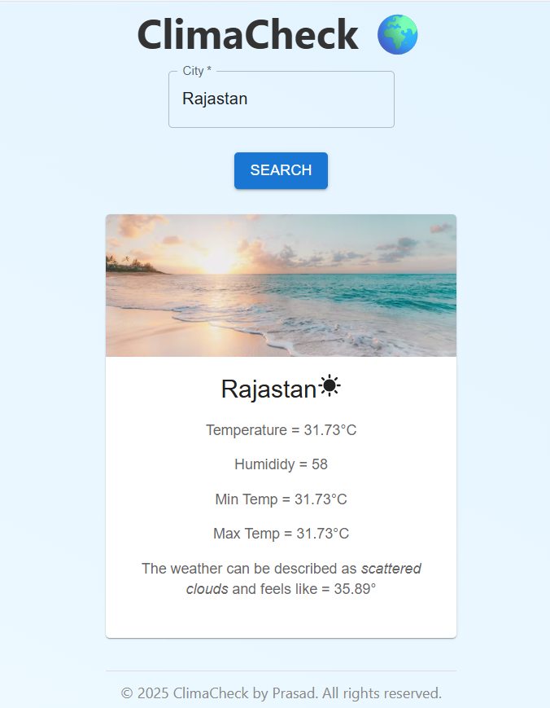
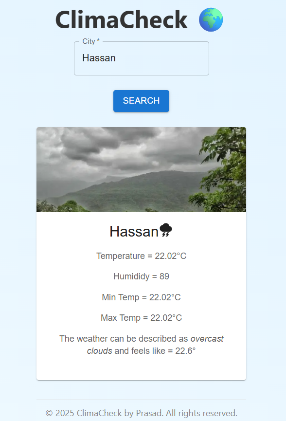
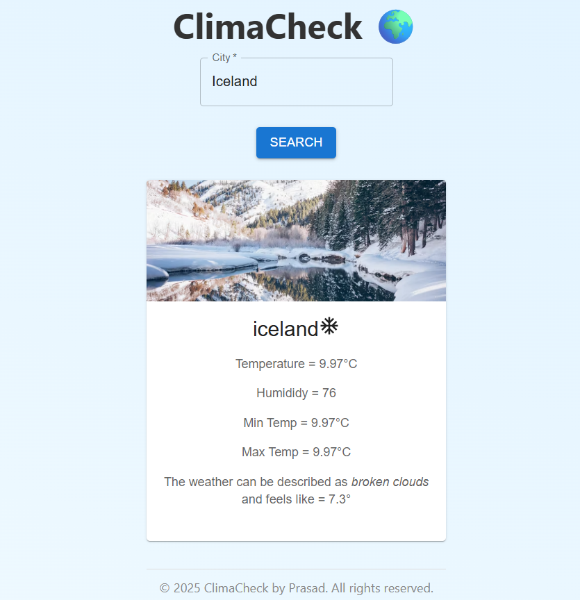

# 🌦️ ClimaCheck

ClimaCheck is a sleek, modern weather app built with React and the OpenWeatherMap API. It allows users to search for any city in the world and get real-time weather information including temperature, humidity, weather conditions, and more — all styled with MUI (Material-UI).

---

## 📸 Screenshots

| Home Page | Warm Weather | Cold Weather |
|-----------|---------------|---------------|
|  |  |  |


---

## 🔥 Features

- 🌍 Search weather by city name globally
- 🌡️ Real-time temperature, humidity, min/max temps
- 🎨 Dynamic weather image (cold, hot, rain)
- 🧼 Clean UI using Material-UI (MUI)
- 🖼️ Custom pale gradient background for clarity
- ⚠️ Error handling for invalid cities
- 📱 Fully responsive design

---

## 🚀 Live Demo

👉 [ClimaCheck Live on GitHub Pages](https://Prasad-hg.github.io/climacheck)


---

## 🧰 Tech Stack

- ⚛️ React (Create React App)
- 🎨 Material-UI (MUI)
- 🌐 OpenWeatherMap API
- 🧑‍💻 HTML, CSS (custom + MUI)
- 📦 gh-pages for deployment

---

## 📦 Setup & Installation

### 1. Clone the Repo

```bash
git clone https://github.com/your-username/climacheck.git
cd climacheck

2. Install Dependencies

npm install
3. Start the App Locally

npm start
4. Build & Deploy to GitHub Pages

npm run deploy

🔑 API Used
OpenWeatherMap API
Free weather data API
Sign up to get an API key: https://openweathermap.org/api


✍️ Author
Made with ☁️ by Prasad H G

📝 License
This project is licensed under the MIT License

🙌 Contributions
Contributions, issues, and suggestions are welcome!